# Actividad Unidad 5 - Automatización del ciclo de vida de una Aplicación.

**Prerrequisitos**

- **Máquina Virtual de KALI Linux**: en esta ocasión vamos a hacer la actividad directamente sobre la MV de Kali Linux

- **Crear o utilizar repositorio en GitHub.com:**

**Índice**

1. [Objetivos](#objetivos)
1. [Infraestructura y herramientas a utilizar](#infraestructura-y-herramientas-a-utilizar)
1. [Ciclo de vida IC/DC - DevOps](#ciclo-de-vida-icdc---devops)
1. [Preparar laboratorio](#preparar-laboratorio)
1. [Crear ciclo de vida completo en equipo local ](#crear-ciclo-de-vida-completo-en-equipo-local)
1. [Automatización de la construcción con Jenkins](#fase-2-automatización-de-la-construcción-con-github-actions)
1. [Automatización y securización del despliegue con Jenkins](#automatización-y-securización-del-despliegue-con-jenkins)
1. [Dejando todo en órden](#dejando-todo-en-órden)

---
# OBJETIVOS

1. Comprender el ciclo de vida de una aplicación desde el código fuente hasta su despliegue, identificando las fases principales de CI y CD.

1. Aplicar procesos de construcción y pruebas de forma manual en el equipo local, utilizando herramientas como Maven para compilar, testear y generar el artefacto.

1. Automatizar el flujo de integración continua mediante Jenkins, entendiendo el papel de los disparadores, los jobs y los pipelines/workflows.

1. Diferenciar entre ejecución manual y automatizada del proceso de build y despliegue, valorando las ventajas de la automatización en repetibilidad, trazabilidad y reducción de errores.

1. Generar y desplegar un artefacto de aplicación en un entorno controlado mediante Docker y Docker Compose, comprendiendo el papel de la imagen y del contenedor en la fase de despliegue.

1. Analizar y comparar distintas herramientas DevOps para CI/CD, reconociendo sus similitudes, diferencias y escenarios de uso más adecuados.

---
# INFRAESTRUCTURA Y HERRAMIENTAS A UTILIZAR.


**Infraestructura Técnica Integrada**

Diagrama de flujo de operaciones:  

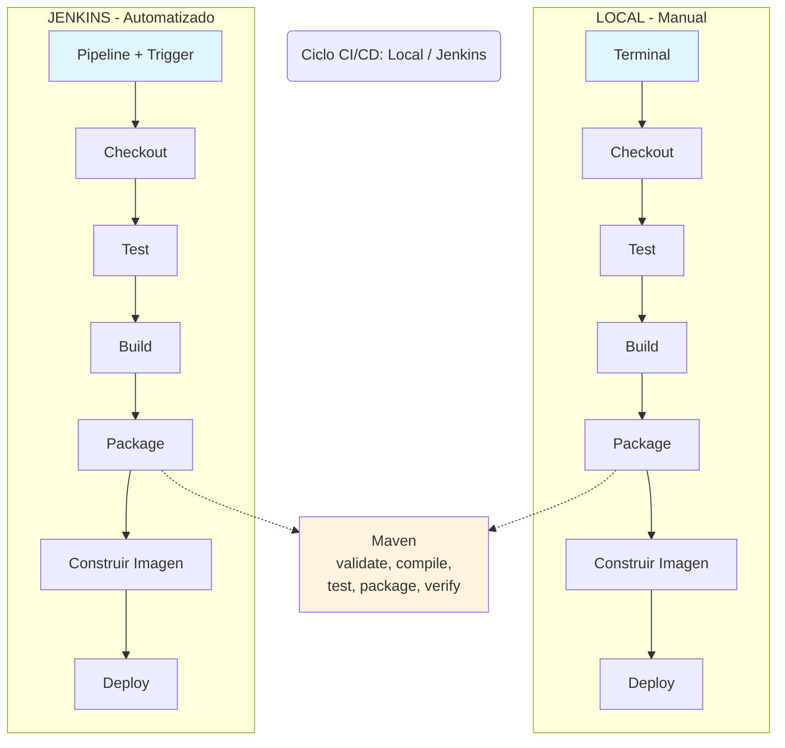
```mermaid
flowchart TB
    title(Ciclo CI/CD: Local / Jenkins)
    
    subgraph local ["LOCAL - Manual"]
        local_start[Terminal]
        local1[Checkout]
        local2[Test]
        local3[Build]
        local4[Package]
        local5[Construir Imagen]
        local6[Deploy]
    end
    
    subgraph jenkins ["JENKINS - Automatizado"]
        jenkins_start[Pipeline + Trigger]
        jenkins1[Checkout]
        jenkins2[Test]
        jenkins3[Build]
        jenkins4[Package]
        jenkins5[Construir Imagen]
        jenkins6[Deploy]
    end
    

    
    local_start --> local1 --> local2 --> local3 --> local4 --> local5 --> local6
    jenkins_start --> jenkins1 --> jenkins2 --> jenkins3 --> jenkins4 --> jenkins5 --> jenkins6
    
    maven[Maven<br/>validate, compile,<br/>test, package, verify]
    local4 -.-> maven
    jenkins4 -.-> maven
    

    classDef start fill:#e1f5fe
    classDef maven fill:#fff3e0
    class local_start,jenkins_start start
    class maven maven
```
**Componentes de la Infraestructura**


| Componente   | Función              |  
| ------------ | -------------------- |  
| Jenkins      | Servidor de automatización |  
| GitHub.com   | Servidor remoto SVC   |   
| Docker       |  Creación de contenedor de la app |   
| Maven        | Automatización de la construcción |
| Kubernetes   | Automatización del despliegue |
| Minikube     | para creación de cluster para kubernetes|
| Trivy        | Herramienta de escaneo de seguridad |


---
# CICLO DE VIDA IC/DC - DevOps.

La secuencia de build, test y deploy que hacemos en `Jenkins` o `GitHub Actions` corresponde a la fase de CI/CD del ciclo DevOps. El mantenimiento (correcciones, mejoras, parches) entra después de que la aplicación ya está en producción y se monitoriza, y forma el siguiente ciclo de iteraciones, no la parte que se ejecuta directamente en el CI tradicional.

Por lo tanto las etapas del ciclo de vida `IC/DC - DevOps` son:

- **Checkout** / obtención del código: clonar o recuperar el repositorio.

- **Build / compilación**: compilar el proyecto Java.

- **Test**: ejecutar pruebas automatizadas.

- **Package** / **artefacto**: generar el jar o war.

- **Verify**: comprobar que el paquete cumple criterios de calidad; aquí pueden entrar validaciones extra o pruebas de integración.

- **Deploy**: desplegar la aplicación o publicar el artefacto en un repositorio/servidor.


Vamos a realizar estas operaciones y por lo tanto a ejecutar el ciclo completo de la aplicación utilizando las herramientas:

- `Checkout` desde `Jenkins` o directamente `GitHub`.
- `Build`, `test`, `package`, `verify` con Maven.
- `Deploy` con `docker` - `Compose`.

---
# PREPARAR LABORATORIO

1. Utilizamos el repositorio  para realizar esta. **Observa  que tendrás que actualizar los ficheros, ya que tanto aplicación como diferentes archivos son diferentes**.

```bash 
# crea variable con tu nombre
TuNombre=Aquí_Pones_Tu_Nombre
# Creamnos carpeta
mkdir -p Unidad5/Actividad-CicloVida
# Nos colocamos en ella
cd Unidad5/Actividad-CicloVida
```

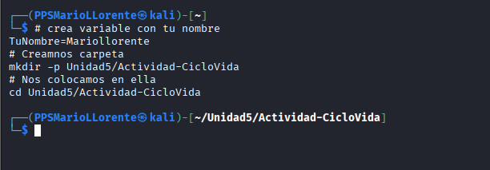

La aplicación `store-app` que estamos utilizando está escrito en `Spring`y como hemos visto en el `pom.xml` está escrito para ejecutarse con `java 11`. Por ello necesitamos tener instalado `java 11` para poder ejecutarlo.

2. Comprobamos si tenemos instalado java 11 en nuestro equipo:

```bash
update-alternatives --list java
```
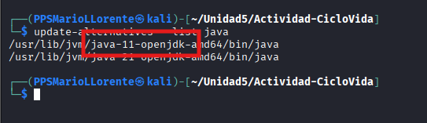

Si la tenemos instalada nos aparecerá ahí.

3. Si no lo tenemos, lo hacemos.

```bash
sudo apt update
# Instalamos Java 11.
sudo apt install openjdk-11-jdk maven
```
4. Le indicamos al sistema que queremos usar java 11

```bash
# elegimos java-11
sudo update-alternatives --config java
# elegimos java-11
sudo update-alternatives --config javac
```
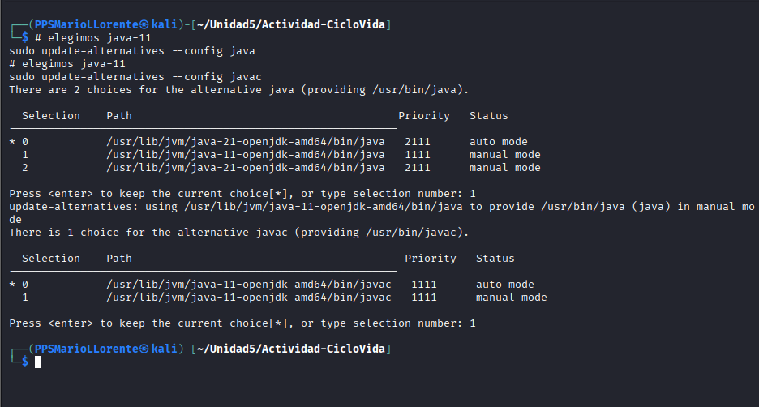

5. Descomprimir la aplicación store-app-postgree.zip

```bash
# coloca store-app-postgree.zip en la carpeta
# descomprime 
unzip store-app.zip 
# comprueba que se ha descomprimido
cd store-app
```

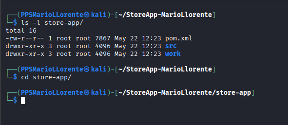

6. **Descargar los archivos Dockerfile y el manifiesto de despliegue de kubernetes en la carpeta**.

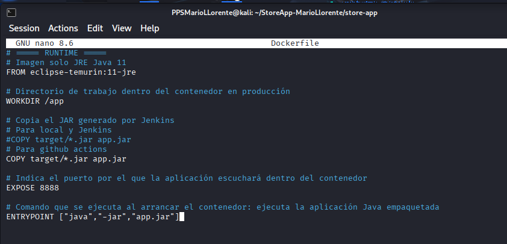

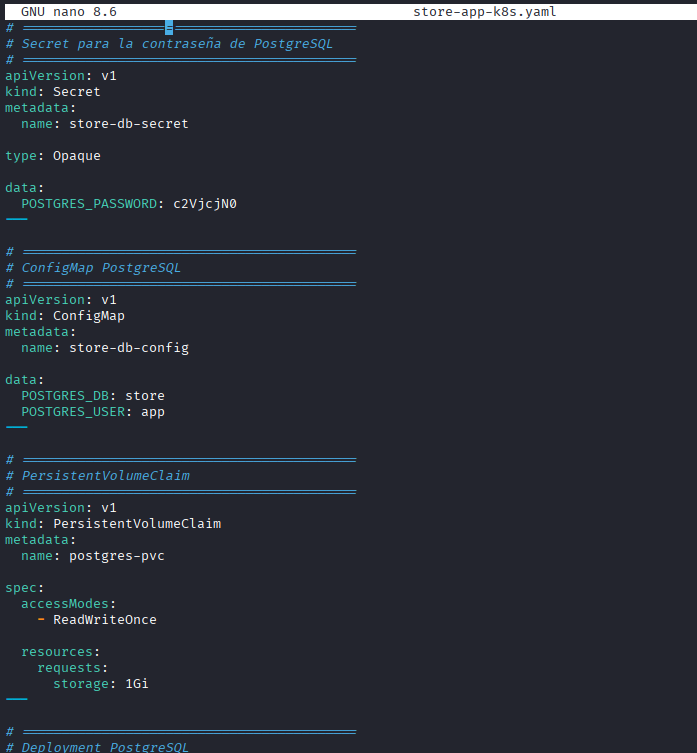

7. **Subir los cambios al repositorio**.

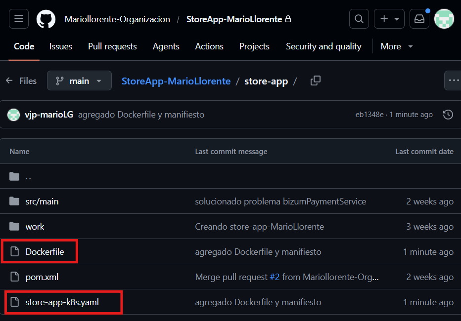

8. Comprobar que está instalado `Maven`:

```bash
# comprobamos versión de maven
mvn --version
# sino tenemos instalamos
# sudo apt udate; sudo apt install maven 
```

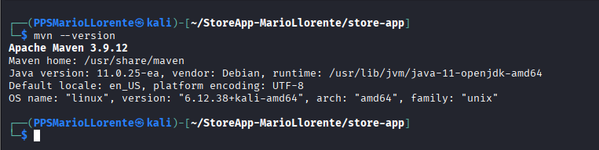

9. Da permisos para ejecutar `Docker` a `Jenkins`:

```bash
sudo usermod -aG docker jenkins
sudo systemctl restart jenkins
```

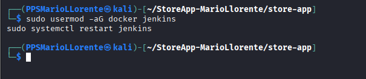

---
# CREAR CICLO DE VIDA COMPLETO EN EQUIPO LOCAL

**Flujo de trabajo Ciclo completo en equipo local**

1. Descargar Aplicación.
1. Descomprimir aplicación.
1. Instalar/comprobar java11.
1. Ejecutar Maven.
1. Construir imagen Docker.
1. Lanzar escenario Docker compose
1. Acceder a la aplicación.


## Maven package: validate, compile, test, package

Como hemos visto en la actividad sobre `Maven` en el **ciclo vida `default` de Maven realiza**: **validate -> compile -> test -> package -> verify -> install  -> verify** si bien estos dos últimos se referían a la copia del **paquete generado** a los repositorios local y remoto.

Recordamos también que en el caso de `Java` en la etapa **package** se generan uno o varios **artifact** con la aplicación empaquetada (normálmente un .jar).


Por lo tanto para realizar las fases indicadas tan sólo es necesario realizar un `mvn package`.

1. Comprobamos que tenemos java 11:

```bash
java --version
```
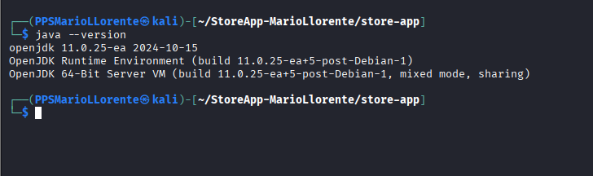

2. Realizamos operaciones **validate, compile**  con maven:
```bash
# realizamos operaciones en maven
mvn compile
```

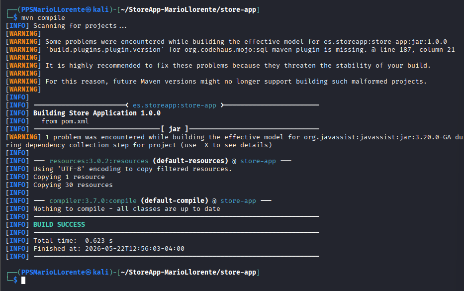

3. Pasamos los test **test**  con maven:
```bash
# realizamos operaciones en maven
mvn test
```
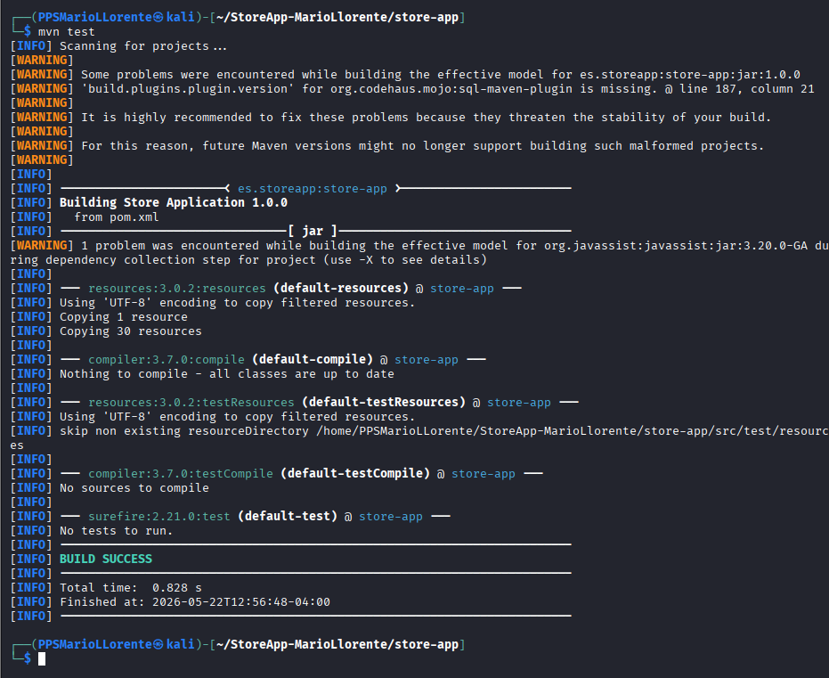


4. Realizamos operación **package**  con maven para jenerar el código compilado:
```bash
# realizamos operaciones en maven
mvn package
```

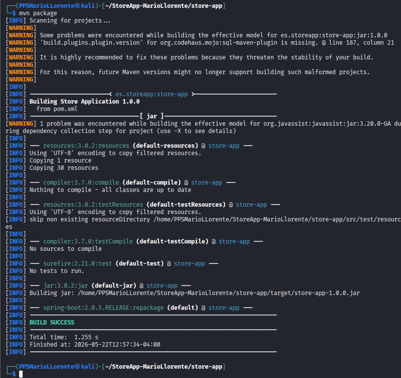

5. Comprobamos que no hay errores y se ha generado el `artifact`:

```bash
# listamos /target y veremos el artifact (.jar generado)  store-app-1.0.0.jar
ls ./target
```
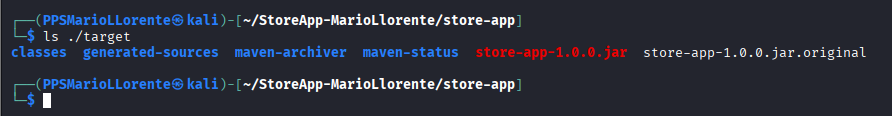

> Se ha generado la aplicación compiladad (artifact) **store-app-1.0.0.jar**
> La necesitaremos para el deploy.

## Deploy: Construir imagen y levantar máquinas

Una vez que el build de la aplicación Java genera el `jar` (habitualmente en la fase de CI mediante Maven), la siguiente gran fase es **el despliegue (Deploy)**. En este contexto, **Deploy** incluye no solo copiar o ejecutar el artefacto, sino también preparar el entorno de ejecución.

En nuestro caso, eso se traduce en dos pasos:    

1. **Crear una imagen Docker** a partir de un `Dockerfile`, empaquetando la JVM, el `jar` y la configuración necesaria para que la aplicación se ejecute de forma aislada y reproducible.

Dockerfile
```yaml
# ===== RUNTIME =====
# Imagen solo JRE Java 11
FROM eclipse-temurin:11-jre

# Directorio de trabajo dentro del contenedor en producción
WORKDIR /app

# Copia el .jar generado en el stage de build hacia el contenedor de runtime
# Usa --from=build para acceder a lo construido en el stage anterior
COPY target/*.jar app.jar

# Indica el puerto por el que la aplicación escuchará dentro del contenedor
EXPOSE 8888

# Comando que se ejecuta al arrancar el contenedor: ejecuta la aplicación Java empaquetada
ENTRYPOINT ["java","-jar","app.jar"]
```
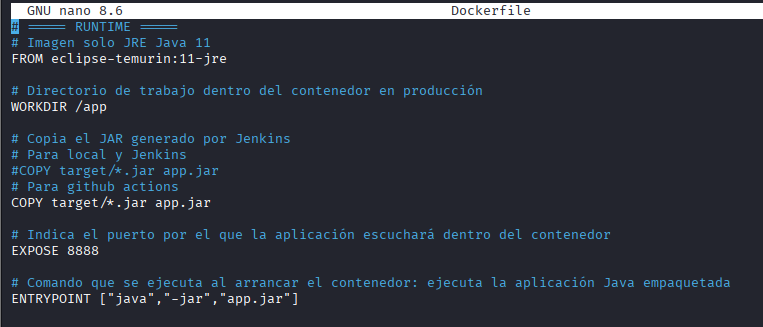

- Copiamos Dockerfile, creamos imagen y comprobamos si se ha creado
```bash
nano Dockerfile
# copiamos el contenido del Dockerfile
# Guardamos los cambios ctrl + x
# creamos la imagen con nombre store-app
docker build -t store-app .
# comprobamos si se ha creado la imagen
docker images |grep store
```

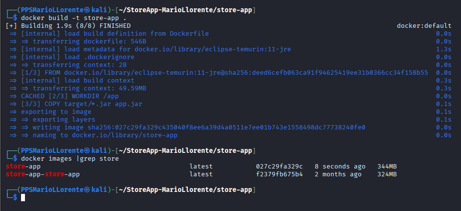


2. **Levantar el escenario con `docker-compose`**, que permite orquestar varios servicios (por ejemplo, aplicación + base de datos + red) como un entorno completo, listo para pruebas o producción.

Esta imagen utiliza una BBDD postgree, por ello utilizamos un escenario con:
- Web app
- BBDD Postgree

[docker-compose.yml](./files/docker-compose.yml)
```yaml
# Versión de sintaxis de Docker Compose
version: '3.8'

services:
  # Servicio de base de datos PostgreSQL
  db:
    # Imagen oficial de PostgreSQL 15
    image: postgres:15
    # Variables de entorno que configuran la base de datos
    environment:
      POSTGRES_DB: store          # Nombre de la base de datos
      POSTGRES_USER: app          # Usuario de base de datos
      POSTGRES_PASSWORD: secr3t   # Contraseña del usuario
    # Mapeo de puertos: host:contenedor
    ports:
      - "5432:5432"               # Puerto 5432 accesible desde fuera

  # Servicio de la aplicación Java
  app:
    # Construye la imagen a partir del Dockerfile en el directorio actual
    build: .
    # Indica que el servicio app depende de db (db se inicia primero)
    depends_on:
      - db
    # Exponer el puerto 8888 del contenedor al host
    ports:
      - "8888:8888"
```

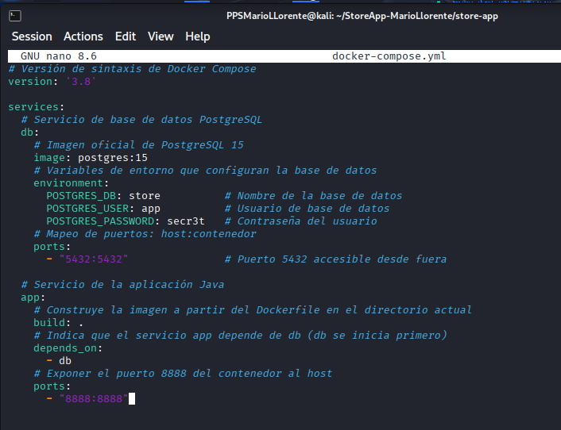

- Para levantar el escenario multicontenedor, como estamos ya situados en la carpeta correcta:

```bash
# Creamos el docker-compose.yml
nano docker-compose.yml
# introducimos el contenido del docker-commpose.
# Guardamos los cambios ctrl + x
# la primera vez levantamos sin modo demonio para observar los logs por si hubiera algún error
docker compose up
# Luego ya podemos levantar en modo demonio
# docker compose up -d
```
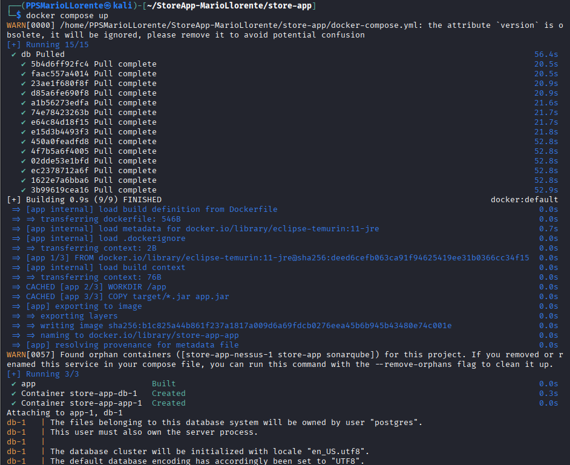

Accermos a la aplicación generada: http://localhost:8888


De esta forma, el ciclo de CI/CD se completa:
**Compilar → Testear → Generar el jar → Crear la imagen Docker → Desplegar el entorno con docker-compose.**

> Una vez terminado **finalizamos la ejecución** del escenario:

```bash
#  CTRL + C para salir de contenedor
## paramos escenario
docker compose down
# para volver a levantarlo
# docker compose up -d
```
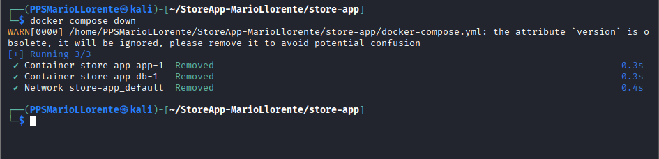

---
# AUTOMATIZACIÓN DE CONSTRUCCIÓN CON JENKINS

**Flujo de trabajo Ciclo completo IC/DC Jenkins**

1. Subir el proyecto a un repositorio de GitHub.
1. comprobación de Java,
1. checkout del repositorio,
1. Ejecución de test
1. ejecución de Maven,
1. construcción de la imagen Docker.
1. Levantar escenario multicontenedor
1. Observar la ejecución del workflow en GitHub Actions.
1. Analizar qué ha hecho el pipeline y en qué orden.
1. Comparar ejecución manual frente a ejecución automatizada.


## Preparar entorno.

Tenemos en nuestra MV java11. Jenkins usa superior a 21, por lo que tenemos que volver a dejar el java que teníamos antes.

1. Cambiar Java:

```bash
# Dejábamos el java que teníamos
sudo update-alternatives --config java
# Dejábamos el java que teníamos
sudo update-alternatives --config javac
# comprobamos java > 21
java --version
```
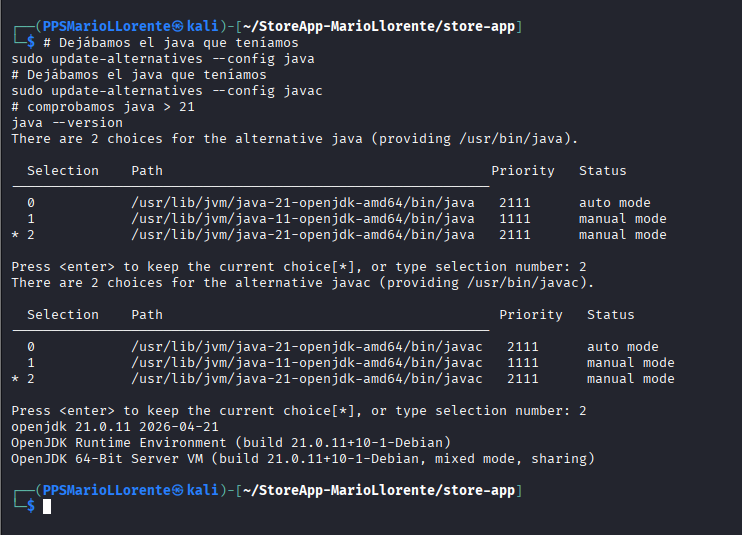

2. Arrancar `Jenkins`:

```bash
service jenkins start
```

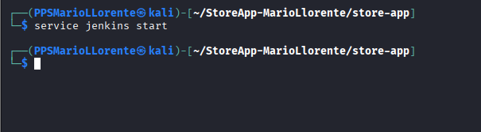

3. Acceder a Jenkins:

http://localhost:8080

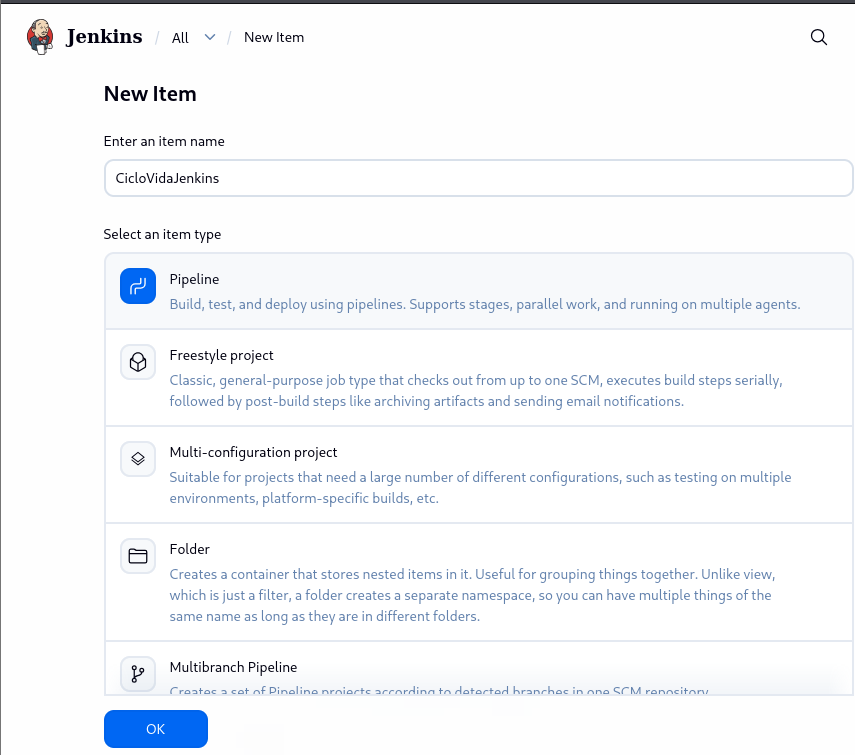

## Checkout del repositorio.

Ahora lo primero que tenemos que hacer es descargar el repositorio, por lo tanto:

1. Crear nueva tarea con nombre `CicloVidaJenkins` y este pipeline:

> **¡¡¡OJO tienes que poner la dirección de tu repositorio¡¡¡** 

```grovy
pipeline {
    agent any

    stages {
        stage('Clonar repositorio') {
            steps {
                git branch: 'main',
                credentialsId: 'TuIDToken', // Tu ID definido en Jenkins
                    url: 'https://github.com/PPSvjpOrganizacion/-PPSvjp.git'
            }
        }

        stage('Verificar contenido') {
            steps {
                sh 'echo "Repositorio clonado correctamente"'
                sh 'pwd'
                sh 'ls -la'
                sh 'git branch -a || true'
            }
        } 
    }

    post {
        success {
            echo 'Git clonado correctamente rectamente'
        }
        failure {
            echo 'La clonación ha fallado'
        }
        
    }
}
```
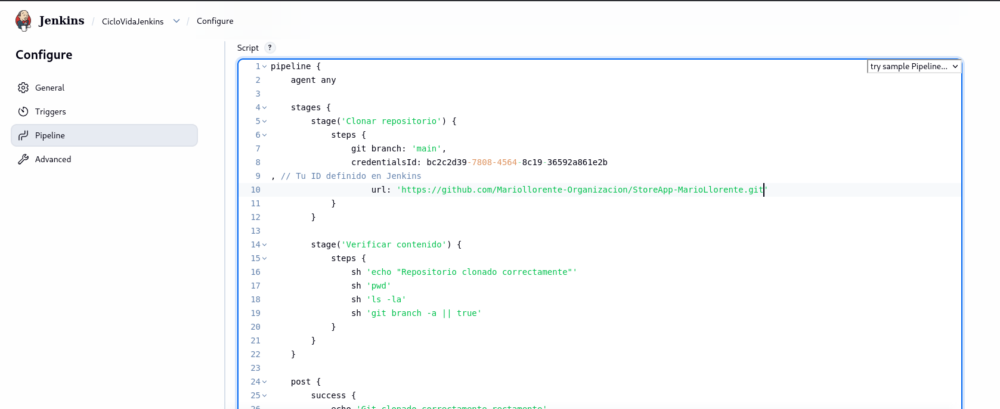

Vemos que hemos hecho las siguientes etapas:
- Clonar repositorio 
- Verificar contenido: hacemos en comando listado de directorio, y mostramos ramas.

2. **Guardar cambios**.

3. **Construir ahora**

4. Comprobar si se realiza la ejecución. Podemos ver detalles en **Tarea CicloVidaJenkins -> nºBuild -> Pipeline Overview**.


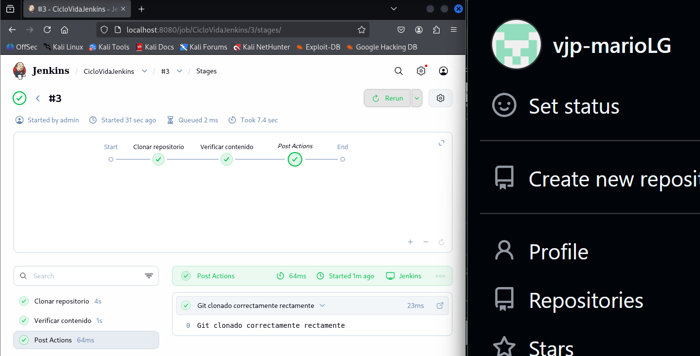


## Maven package: validate, compile, test, package

El siguiente paso sería añadir un paso con la compilación con Maven, no obstante lo vamos a hacer en dos pasos para que veamos la importancia de los test, por una parte vamos a hacer los tres primeros pasos: **validate, compile, test** y posteriormente haremos únicamente la contrucción del paquete: **Package**.

1. Modificamos el pipeline **Tarea CicloVidaJenkins -> Configurar**.    
[El contenido del pipeline está aquí](./files/pipelineTest.groovy)

El resto del archivo queda igual pero añadimos el paso y cambiamos los mensajes finales:
```grovy
......

        stage('Compilar con Maven') {
            steps {
                 withEnv(["JAVA_HOME=/usr/lib/jvm/java-11-openjdk-amd64","PATH+JAVA=/usr/lib/jvm/java-11-openjdk-amd64/bin"]) {
                    sh 'mvn test'
                }
            }
        }
    }

    post {
        success {
            echo 'Compilación finalizada correctamente'
        }
        failure {
            echo 'La compilación ha fallado'
        }
        always {
            archiveArtifacts artifacts: 'target/*.jar', fingerprint: true, onlyIfSuccessful: false
        }
    }
}
```
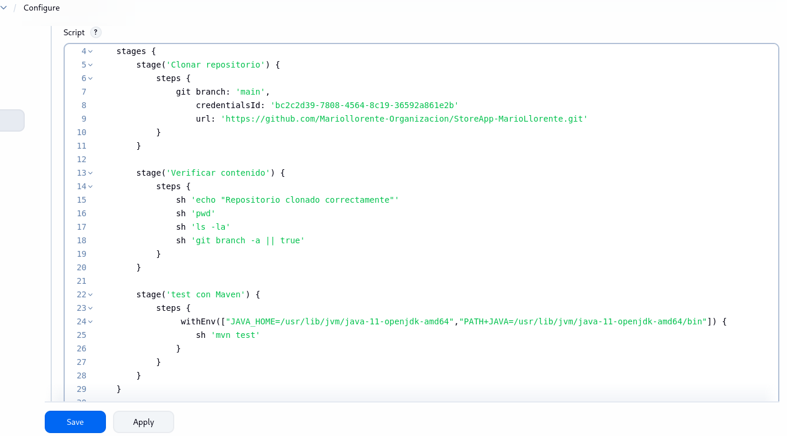

**Package**

2. Modificamos el pipeline **Tarea CicloVidaJenkins -> Configurar**.    
[El contenido del pipeline está aquí](./files/pipelineCicloVidaJenkinsMaven.groovy)

El resto del archivo queda igual pero añadimos el paso y cambiamos los mensajes finales:
```grovy
.....

        stage('Test con Maven') {
            steps {
                 withEnv(["JAVA_HOME=/usr/lib/jvm/java-11-openjdk-amd64","PATH+JAVA=/usr/lib/jvm/java-11-openjdk-amd64/bin"]) {
                    sh 'mvn clean package -DskipTests'
                }
            }
        }
    }

    post {
        success {
            echo 'Compilación finalizada correctamente'
        }
        failure {
            echo 'La compilación  ha fallado'
        }
        always {
            archiveArtifacts artifacts: 'target/*.jar', fingerprint: true, onlyIfSuccessful: false
        }
    }
}
```

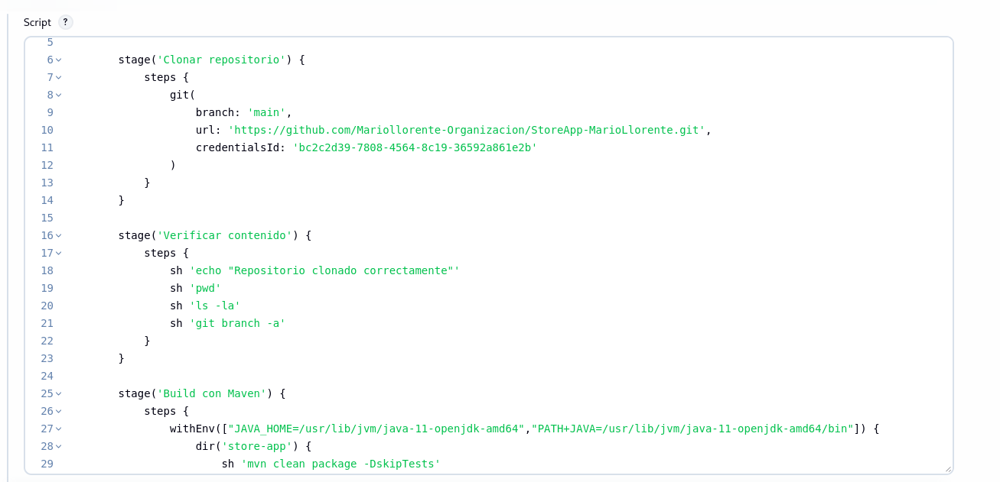

3. Ir a la ejecución y comprobar si está generado el .jar.

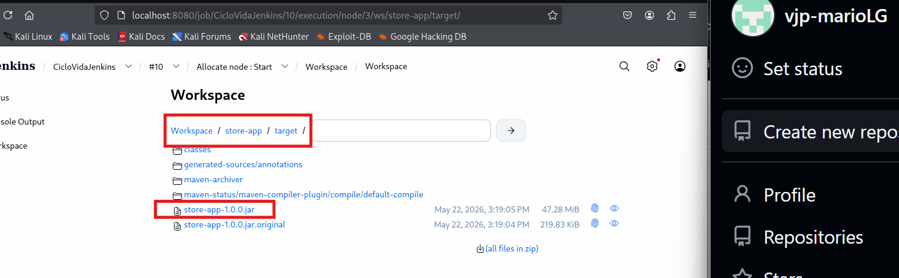

## Deploy: Construir imagen y levantar máquinas

Primero tenemos que hacer unas pequeñas **configuraciones** para que **Docker** le permita ejecutar a Jenkins.

Como va a ser Jenkins quien ejecute docker tenemos que autorizarle:

**Configuración Docker para usar Jenkins**

1. Autorizar a `Jenkins`
```bash
# Damos permisos docker a jenkins
sudo usermod -aG docker jenkins
# reiniciamos serivicio jenkins
sudo systemctl restart jenkins
```
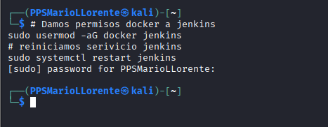

y ya comenzamos a preparar el escenario:


2. **Crear el archivo `Docker-compose.yml`** que usaremos para la levantar el escenario multicontenedor.

docker-compose.yml
```yaml
services:
  # Servicio de base de datos PostgreSQL
  db:
    # Imagen oficial de PostgreSQL 15
    image: postgres:15
    # Variables de entorno que configuran la base de datos
    environment:
      POSTGRES_DB: store          # Nombre de la base de datos
      POSTGRES_USER: app          # Usuario de base de datos
      POSTGRES_PASSWORD: secr3t   # Contraseña del usuario
    # Mapeo de puertos: host:contenedor
    ports:
      - "5432:5432"               # Puerto 5432 accesible desde fuera

  # Servicio de la aplicación Java
  app:
    # la imagen se llama store-app y la hemos generado con 
    # docker build -t store-app .
    image: store-app
    ports:
      # Exponer el puerto 8888 del contenedor al host
      - "8888:8888"
    # Va a esperar a que arranque la aplicación BBDD primero  
    depends_on:
      - db
    environment:
      # url para consultar con BBDD
      SPRING_DATASOURCE_URL: jdbc:postgresql://db:5432/store
      # Usuario de BBDD
      SPRING_DATASOURCE_USERNAME: app
      # contraseña de BBDD
      SPRING_DATASOURCE_PASSWORD: secr3t
```
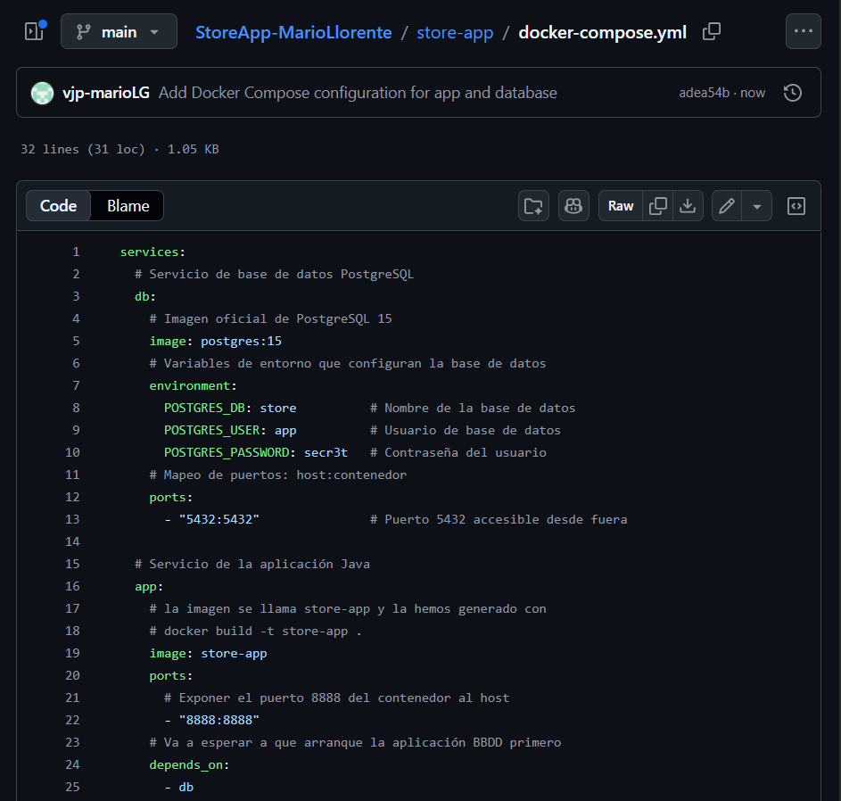

3. **Modificar el pipeline** en **Tarea CicloVidaJenkins -> Configurar**.

El resto del archivo queda igual pero añadimos el paso y cambiamos los mensajes finales:

```grovy
        stage('Generar imagen Docker') {
            steps {
                # construimos la imagen con nombre app-store
                sh 'docker build -t app-store .'
            }
        }

        stage('Levantar escenario con Docker Compose') {
            steps {
                # Detenemos ejecución docker compose y eliminamos volúmenes de anteriores ejecuciones
                sh 'docker-compose down -v || true'
                # levantamos escenario en modo demonio
                sh 'docker-compose up -d'
            }
        }
```
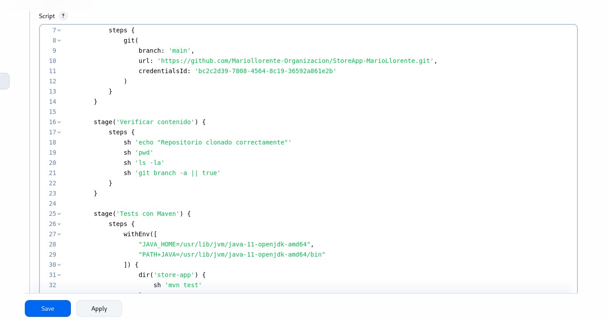

4. **Construir ahora** **Tarea CicloVidaJenkins -> CicloVidaJenkins -> Construir ahora**


```grovy

pipeline {
    agent any

    stages {
        stage('Checkout') {
            steps {
                git branch: 'main',
                    url: 'https://github.com/$TU_USUARIO/store-app.git'
            }
        }

        stage('Comprobar entorno') {
            steps {
                sh 'java -version'
                sh 'mvn -version'
            }
        }

        stage('Ejecutar tests') {
            steps {
                sh 'mvn test'
            }
        }
    }

    post {
        always {
            junit 'target/surefire-reports/*.xml'
        }
    }
}
```

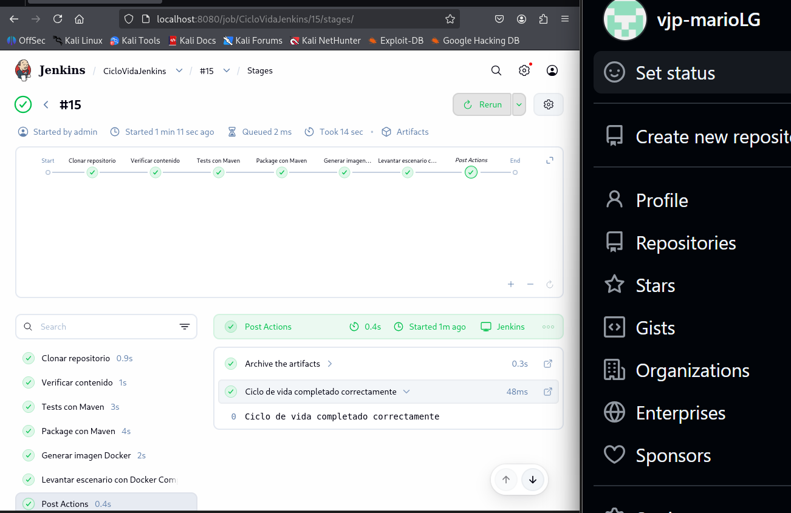

Y vemos cómo se ha completado el ciclo de vida y accedemos a nuestra aplicación: http://localhost:8888

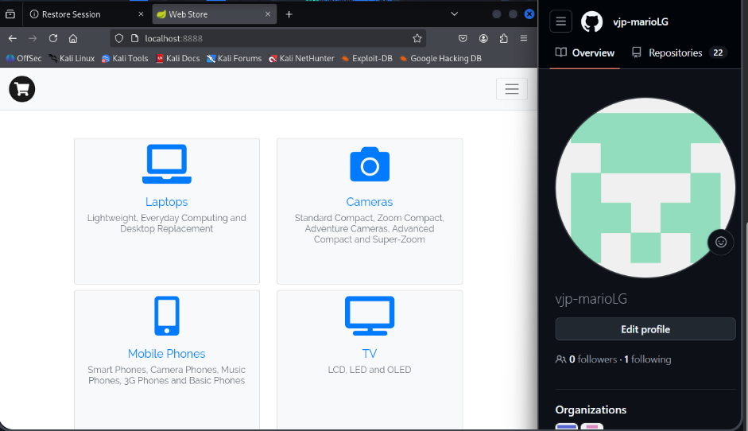

```bash
# Nos vamos al workspace de Jenkins
cd /var/lib/jenkins/workspace/CicloVidaJenkins 
# eliminamos escenario
docker compose down -v
```

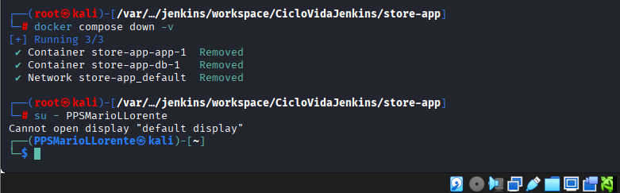

---
# AUTOMATIZACIÓN Y SECURIZACIÓN DEL DESPLIEGUE CON JENKINS

Vamos a automatizar ahora, el proceso de despliegue y securización con kubernetes de `store-app`.

**El flujo del pipeline quedará así:**

```text
Git Clone
   ↓
Tests
   ↓
SAST (opcional)
   ↓
Build JAR
   ↓
Build Docker image
   ↓
Trivy Image Scan
   ↓
Trivy Secret Scan
   ↓
Trivy Kubernetes Deployment Scan
   ↓
Deploy Kubernetes
   ↓
Verificaciones
```
## Pipeline optimizado


Aquí está el pipeline con todas las opciones de desplegado y securización. Se explican  los cambios a continuación.

```grovy
pipeline {
    agent any
    environment {
        JAVA_HOME = "/usr/lib/jvm/java-11-openjdk-amd64"
        PATH = "${env.PATH}:${JAVA_HOME}/bin"
        MINIKUBE_PROFILE = "store-app"
    }

    stages {
        stage('Clonar repositorio') {
            steps {
                git branch: 'main',
                credentialsId: 'TuIDToken', // Tu ID definido en Jenkins
                    url: 'https://github.com/PPSvjp/store-app-PPSvjp.git'
            }
        }

        stage('Verificar contenido') {
            steps {
                sh 'echo "Repositorio clonado correctamente"'
                sh 'pwd'
                sh 'ls -la'
                sh 'git branch -a'
            }
        }
        stage('Build con Maven') {
            steps {
                    sh 'mvn clean package -DskipTests'
            }
        }

        stage('Dependency Check') {
            steps {
                sh """
            
                # Tarda mucho tiempo por lo que es conveniente realizarla sólo una vez o bien
                # solicitar un NVD API KEY  de la nvd para agilizar proceso
                # mvn org.owasp:dependency-check-maven:check
                    
                """
            }
        }
        
        stage('Iniciar Minikube') {
            steps {
                sh '''
                    echo "Eliminando perfil previo..."
                    minikube delete -p ${MINIKUBE_PROFILE} || true
        
                    echo "Iniciando Minikube..."
                    minikube start \
                        --driver=docker \
                        --nodes=1 \
                        -p ${MINIKUBE_PROFILE}
        
                    kubectl config use-context ${MINIKUBE_PROFILE}
                '''
            }
        }
        
        stage('Construir imagen Docker') {
            steps {
                sh '''
                    echo "Construyendo imagen Docker..."
                    
                    docker build -t store-app:latest .
        
                    echo "Cargando imagen en Minikube multinodo..."
        
                    minikube image load store-app:latest -p ${MINIKUBE_PROFILE}
                '''
            }
        }

        stage('Escaneo imagen Docker') {
            steps {
                sh """
                    echo "Escaneando imagen con Trivy..."

                    trivy image \
                        --severity HIGH,CRITICAL \
                        --exit-code 0 \
                        store-app:latest
                """
            }
        }
        stage('Escaneo secretos') {
            steps {
                sh """
                    echo "Buscando secretos..."

                    trivy filesystem \
                        --scanners secret \
                        .
                """
            }
        }
        
        stage('Escaneo Kubernetes') {
            steps {
                sh """
                    trivy config .
                """
            }
        }

        stage('Desplegar en Kubernetes') {
            steps {
                sh '''
                    echo "Aplicando manifiestos Kubernetes..."

                    kubectl apply -f store-app-k8s.yaml
                '''
            }
        }

        stage('Esperar despliegue') {
            steps {
                sh '''
                    echo "Esperando a que el deployment esté listo..."
                    # Para depuración podemos ver estado de pods cada 20 segundos añadiendo las lineas
                    #kubectl get pods 
                    #sleep 20 
                    kubectl get pods
                    kubectl rollout status deployment/store-db --timeout=120s
                   
                    kubectl get pods
                    kubectl rollout status deployment/store-app --timeout=120s
                '''
            }
        }

        stage('Mostrar estado') {
            steps {
                sh '''
                    echo "Pods desplegados:"
                    kubectl get pods -o wide

                    echo ""
                    echo "Servicios:"
                    kubectl get svc

                    echo ""
                    echo "URL aplicación:"
                    minikube service store-app -p ${MINIKUBE_PROFILE} --url
                '''
            }
        }        
        
    }
}
```
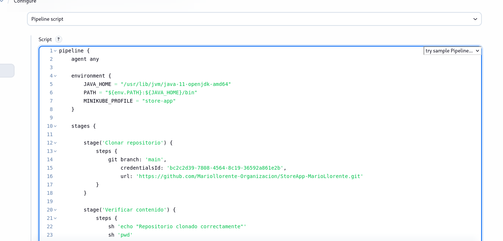

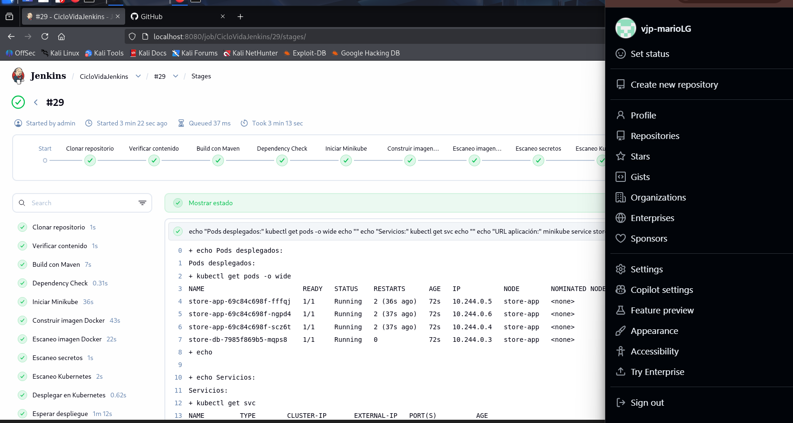

Una vez finalizado **eliminamos el escenario**:


## Securización de Store-APP en Jenkins

**Hardening de Kubernetes**

Para hacer hardening de `Kubernetes` podemos añadir en la sección `containers` del despliegue:

```yaml
securityContext:
  runAsNonRoot: true
  allowPrivilegeEscalation: false
  readOnlyRootFilesystem: true
```
De esta forma:
- Impide ejecutar el contenedor como `root`.
- Evita que procesos ganen más privilegios.
- Hace el filesystem raíz de solo lectura.

### Instalar trivy

Trivy es una utilidad de escaneo ideal, ya que es simple, es un binario ejecutable y es muy usado en la industria.   
Escanea **CVEs, secrets, problemas de configuración, dependencias, imágenes docker y manifests de Kubernetes**.

1. Instalar `Trivy`:

```bashsudo apt install wget apt-transport-https gnupg lsb-release -y

wget -qO - https://aquasecurity.github.io/trivy-repo/deb/public.key | \
gpg --dearmor | sudo tee /usr/share/keyrings/trivy.gpg > /dev/null

echo "deb [signed-by=/usr/share/keyrings/trivy.gpg] \
https://aquasecurity.github.io/trivy-repo/deb $(lsb_release -sc) main" | \
sudo tee /etc/apt/sources.list.d/trivy.list

sudo apt update
sudo apt install trivy -y
```

### Ejecución del pipeline securizado

**Escaneo Maven con OWASP Dependency Check**

Ejecutar escaneo de dependencias `Maven` para detectar vulnerabilidades.

```groovy
stage('Dependency Check') {
    steps {
        sh """
       
          # Tarda mucho tiempo por lo que es conveniente realizarla sólo una vez o bien
          # solicitar un NVD API KEY  de la nvd para agilizar proceso
          # mvn org.owasp:dependency-check-maven:check
               
         """
    }
}
```


**Escaneo de imágen Docker con Trivy**

`Trivy` **escaneará la imágen Docker** que se ha creado con la aplicación en **busca de vulnerabilidades**.

Utilizamos el siguiente stage:

```groovy
stage('Escaneo imagen Docker') {
    steps {
        sh """
            echo "Escaneando imagen con Trivy..."

            trivy image \
                --severity HIGH,CRITICAL \
                --exit-code 0 \
                store-app:latest
        """
    }
}
```

Con los parámetros `--severity HIGH,CRITICAL --exit-code 0 ` sólo muestra vulnerabilidades importantes y además no rompe el pipeline, es decir, sólo nos muestra la información sin dar error.

Podemos observar los resultados y ver cómo nos dá muchíiisimas vulnerabilidades. Despliegar la pestaña para verlas.

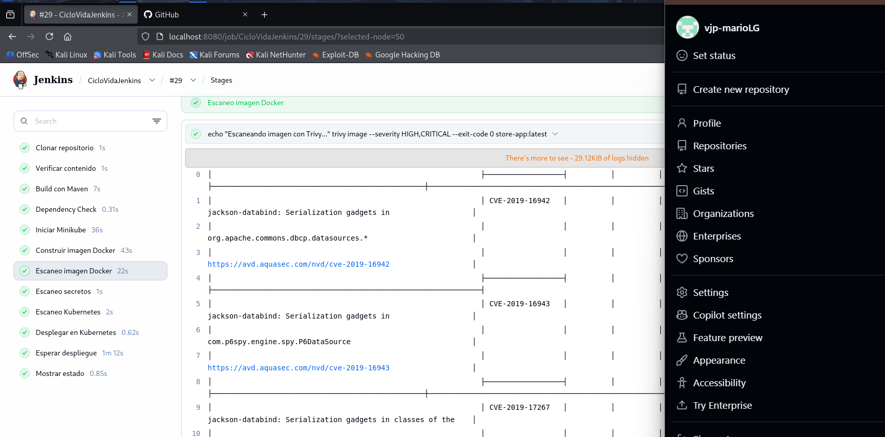

**Escaneo de SECRETS con Trivy**

Utilizamos el siguiente `stage` para detectar: Password hardcodeadas, AWS keys, tokens, private keys, credenciales GitHub, etc....

```groovy
stage('Escaneo secretos') {
    steps {
        sh """
            echo "Buscando secretos..."

            trivy filesystem \
                --scanners secret \
                .
        """
    }
}
```

También hay que desplegar la pestaña para verlos 

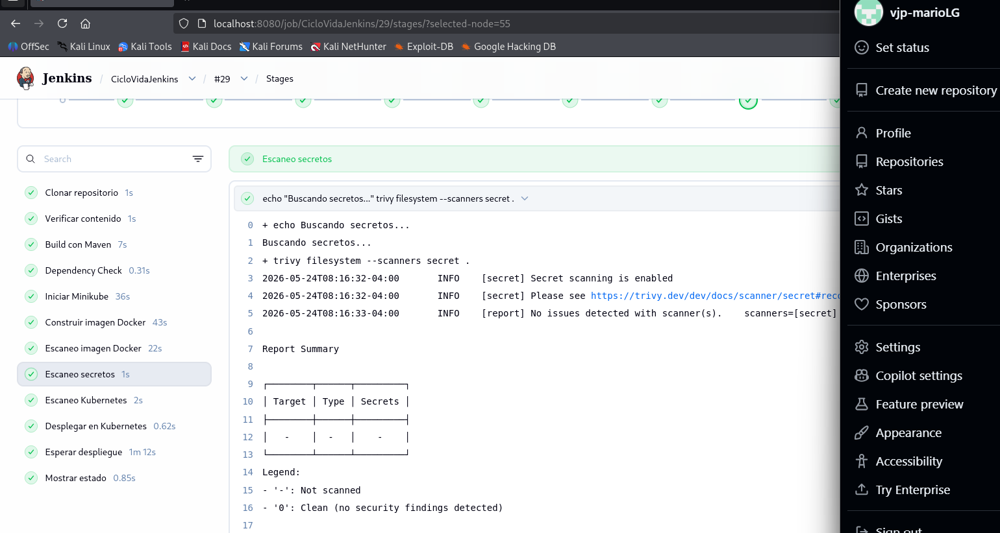


**Escaneo de configuración Kubernetes**

También con `Trivy` podemos detectar problemas en la configuración de `Kubernetes` como containers, privilegiados, ejecución con usuario `root`, falta de `limits`, permisos del proceso, etc.

```groovy
stage('Escaneo Kubernetes') {
    steps {
        sh """
            trivy config .
        """
    }
}
```

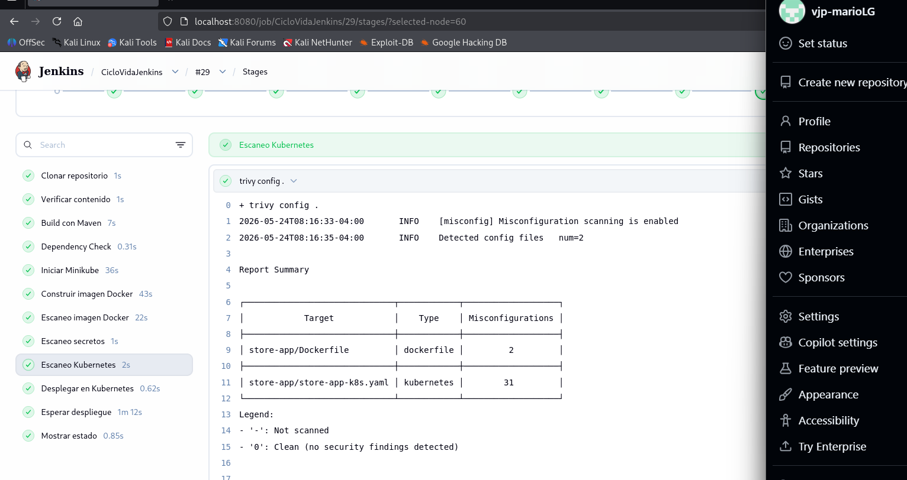

**Endurecimiento de Triby**

Si queremos que en el caso de que detecte vulnerabilidades `CRITICAL` o `HIGH` no proceda a realizar el despliegue, tan sólo tenemos que cambiar el código de salida y colocar en vez de `--exit-code 1`, `--exit-code 0`.


# DEJANDO TODO EN ÓRDEN

Volvemos a dejar la versión de java que teníamos y eliminamos lo generado por Jenkins que sí ocupa bastante espacio:

```bash
# Dejábamos el java que teníamos
sudo update-alternatives --config java
# Dejábamos el java que teníamos
sudo update-alternatives --config javac
# parar y eliminar los contenedores creados
docker ps 
# eliminar los contenedores que siguen levantados
# docker rm -f nombre contenedor
# finalizar y eliminar minikube
minikube stop -p store-app
minikube delete -p store-app
# borramos todos los workspaces de jenkins creados
sudo rm -rf /var/lib/jenkins/workspace/*

```
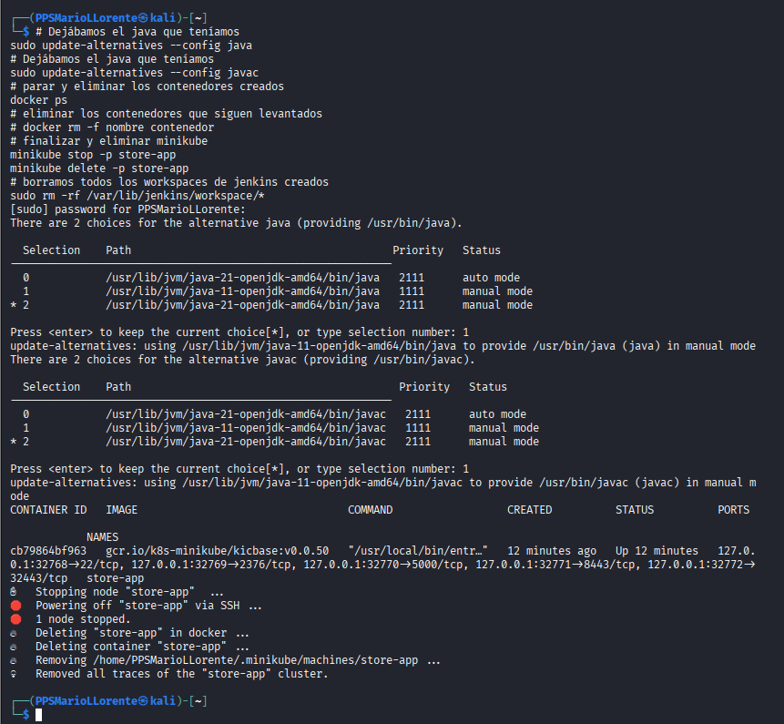